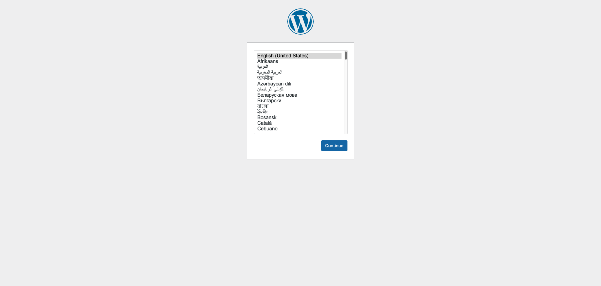

# Wordpress no Kubernetes

## Introdução
Os arquivos YAML neste repositório são usados para definir diversos tipos de objetos Kubernetes, como Pods, Deployments, Services, ConfigMaps, Secrets, entre outros. Ao utilizar esses arquivos, você pode facilmente criar, atualizar e remover recursos em seu cluster Kubernetes.

##  Premissas
* Ter o K3s instalado na máquina
* Ter o KUbectl instalado na máquina

## Passo a passo

### Configurar o cluster
É necessário criar o cluster dentro do k3s
Exemplo usando o K3d responsável por gerenciar o K3s em ambiente Mac
```bash
k3d cluster create kubernetes-cluster
```
### Configuração do ambiente Wordpress

1. Criar o namespace dentro do cluster Kubernetes:
```bash
kubectl create namespace microcontainers
```

2. Criar os volumes utilizados pelas PODs:
* PersistentVolume(PV): volume de armazenamento fisico, e é idependente do ciclo de vida da pod ou do namespace
* PersistentVolumeClaim(PVC): solicitação de armazenamento persistente feito pela pod, é feito um bind junto a PV

2.1 Criar PV e PVC do banco de dados MYSQL:
```bash
kubectl apply -f volumes/pv-mysql.yaml -n microcontainers
kubectl apply -f volumes/pv-claim-mysql.yaml -n microcontainers
```
2.2 Criar PV e PVC do Wordpress:
```bash
kubectl apply -f volumes/pv-wordpress.yaml -n microcontainers
kubectl apply -f volumes/pv-claim-wordpress.yaml -n microcontainers
```

```bash
 # Consultar volumes criados

kubectl get PersistentVolume -n microcontainers
kubectl get PersistentVolumeClaim -n microcontainers
```


3. Criar Secret com credenciais de acesso ao banco de dados:
```bash
kubectl apply -f secrets/database-secret.yaml -n microcontainers

# Consultar secret criado:
kubectl get secret  -n microcontainers
```

4. Deploy do banco de dados MySQL:
```bash
kubectl apply -f deployments/dp-mysql.yaml -n microcontainers
```

5. Criar service do MySQL:
* Service do tipo ClusterIP: permite acesso somente de dentro do cluster
```bash
kubectl apply -f services/svc-mysql.yaml -n microcontainers
```

6. Deploy do Wordpress:
```bash
kubectl apply -f deployments/dp-wordpress.yaml -n microcontainers
```

```bash
#Consultar PODs criadas(Wordpress e Mysql)
kubectl get pod -n microcontainers
```

7. Regra de escalabilidade das PODs do Wordpress:
```bash
kubectl apply -f hpa/hpa-wordpress.yaml -n microcontainers
```

8. Criar service do Wordpress:
* Service do tipo NodePort: fazendo um bind da porta 8080 para a porta 80 dentro do cluster
```bash
kubectl apply -f services/svc-wordpress.yaml -n microcontainers
```
```bash
# Consultar services criados e portas expostas
kubectl get service  -n microcontainers
```
### Acesso ao Wordpress
No navegador acessar o url http://localhost:8080
* No primeiro acesso deverá visualizar a seguinte página:


