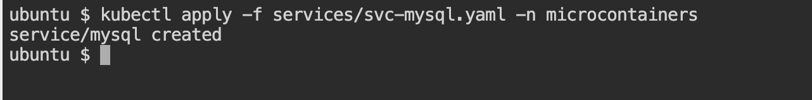
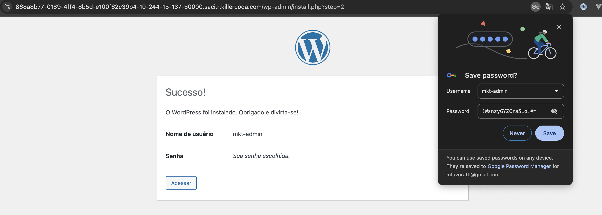

# Wordpress no Kubernetes

## Introdução
Os arquivos YAML neste repositório são usados para definir diversos tipos de objetos Kubernetes, como Pods, Deployments, Services, ConfigMaps, Secrets, entre outros. Ao utilizar esses arquivos, você pode facilmente criar, atualizar e remover recursos em seu cluster Kubernetes.

##  Premissas
* Ter o K3s instalado na máquina
* Ter o Kubectl instalado na máquina
* Descompactar os arquivos deste projeto ou clonar o repositório GIT 
* Entrar na pasta raiz para executar os códigos

Na seção **Executando os passos preparatórios** ao final deste documento, você encontra as instruções para executar o passo-a-passo para criar o ambiente.

## Rodando automação no Linux Ubuntu
A maneira mais simples de executar e testar todo o provisionamento do Wordpress com banco de dados MySql em um ambiente Linux Ubuntu é executando o *shell script* **init.sh** localizado na raiz do projeto. Ele garante que a instalação do K3s exista na máquina e executa o arquivo *kustomization.yaml* responsável por aplicar as configurações no kubernetes.

```bash
# Executando automação
./init.sh
```
Ao final do processo, um comando iniciará em modo vigilante (watch) para validar se os containers foram criados e estão rodando corretamente. Assim que o banco de dados MySQL e duas instâncias do Wordpress estiverem rodando, poderemos abrir no navegador e iniciar as configurações do novo blog.


Para sair do modo vigilante, basta pressionar `CTRL+C`.

Se todo o ambiente estiver pronto, é possível executar diretamente o _kustomization.yaml_ da raiz do projeto. O comando já executa todas as etapas descritas em detalhes no passo-a-passo a seguir.

   ```bash
   # Executando o kustomization.yaml
   kubectl apply -k .
   ```


## Passo-a-passo
Caso você queira subir manualmente, abaixo está descrito cada uma das etapas e seus respectivos comandos, desde que já tenha executado todos os passos descritos na premissa anterior.


### Configuração do ambiente Wordpress

1. Criar o namespace dentro do cluster Kubernetes:
   ```bash
   # Criando namespaces
   kubectl create namespace microcontainers
   ```
   


2. Criar os volumes utilizados pelas PODs:
* **PersistentVolume(PV):** volume de armazenamento fisico, e é idependente do ciclo de vida da pod ou do namespace
* **PersistentVolumeClaim(PVC):** solicitação de armazenamento persistente feito pela pod, é feito um bind junto a PV

   ```bash
   # Criar PV do banco de dados MYSQL:
   kubectl apply -f volumes/pv-mysql.yaml -n microcontainers
   ```
   

   ```bash
   # Criar PVC do banco de dados MYSQL:
   kubectl apply -f volumes/pv-claim-mysql.yaml -n microcontainers
   ```
   

    ```bash
    # Criar PV e PVC do Wordpress:
    kubectl apply -f volumes/pv-wordpress.yaml -n microcontainers
    kubectl apply -f volumes/pv-claim-wordpress.yaml -n microcontainers
    ```
    

    ```bash
    # Consultar volumes criados
    kubectl get PersistentVolume -n microcontainers
    kubectl get PersistentVolumeClaim -n microcontainers
    ```
    

3. Criar Secret com credenciais de acesso ao banco de dados:
   ```bash
   # Criar secret
   kubectl apply -f secrets/database-secret.yaml -n microcontainers

   # Consultar secret criado
   kubectl get secret  -n microcontainers
   ```
   

4. Deploy do banco de dados MySQL:
   ```bash
   # Criando as pods do MySQL
   kubectl apply -f deployments/dp-mysql.yaml -n microcontainers
   ```
   

5. Criar service do MySQL:
   ```bash
   # Service do tipo ClusterIP: permite acesso somente de dentro do cluster
   kubectl apply -f services/svc-mysql.yaml -n microcontainers
   ```
   

6. Deploy do Wordpress:
   ```bash
   # Criando as pods do WP
   kubectl apply -f deployments/dp-wordpress.yaml -n microcontainers
   ```
    

   ```bash
   # Consultar PODs criadas(Wordpress e Mysql)
   kubectl get pod -n microcontainers
   ```
   

7. Regra de escalabilidade das PODs do Wordpress:
   ```bash
   kubectl apply -f hpa/hpa-wordpress.yaml -n microcontainers
   ```
   

8. Criar service do Wordpress:
   ```bash
   # Service do tipo NodePort: fazendo um bind da porta 8080 para a porta 80 dentro do cluster (rodando em ambiente local)
   kubectl apply -f services/svc-wordpress.yaml -n microcontainers
   ```
   

   ```bash
   # Consultar services criados e portas expostas
   kubectl get service  -n microcontainers
   ```
   

### Acesso ao Wordpress
Depois do ambiente provisionado, teremos que acessar a página do Wordpress na porta correspondente.

#### Ambiente Local
Se o tutorial for executado em ambiente local, acessar a url http://localhost:8080 no navegador para abrir a página do Wordpress.

#### Killercoda
Se o tutorial for executado em uma máquina linux virtual, como no KillerCoda (https://killercoda.com/playgrounds/scenario/ubuntu), é necessário fazer a configuração abaixo:

Acessar item **Traffic Ports** no menu da direita


Configurar uma porta 30000 customizada e clicar em Acessar


#### Configurando o Wordpress

No primeiro acesso deverá visualizar a seguinte página, onde é possível configurar *Português do Brasil* ou qualquer outra língua de seu interesse:


Abaixo algumas telas de Configurações do WordPress e páginas do Painel de Administração:




## Executando os passos preparatórios

### Ter o K3s instalado na máquina

```bash
curl -sfL https://get.k3s.io | sh -
```


### Validando o status do k3s
```bash
systemctl status k3s
```


### Clonando o repositório GIT e entrando na pasta raiz
```bash
git clone https://github.com/leocrispindev/wordpress-kubernetes.git && cd wordpress-kubernetes
```

